# Understanding Recurrent Neural Networks

Sources:

Andrej Karpathy blog: The Unreasonable Effectiveness of Recurrent Neural Networks http://karpathy.github.io/2015/05/21/rnn-effectiveness/

Stanford cs231n (spring 2017) lecture 10: Recurrent Neural Networks https://www.youtube.com/watch?v=6niqTuYFZLQ

Chris Olah's Understanding LSTM Networks: http://colah.github.io/posts/2015-08-Understanding-LSTMs/

Visualizing and Understanding Recurrent Networks https://arxiv.org/abs/1506.02078

## Context:

Neural networks like CNNs typically require some fixed-size input, and produce a fixed-size output (see one-to-one in figure below).

RNNs can operate on every item of a sequence; so the length of that sequence can very in size. The output can also vary in size.

- One to many: eg, given an input image, produce a sequence of words that describes it (image captioning)
- Many to one: eg, given an input sequence of words, produce a single label for the text (sentiment classification)
- Many to many: eg, given a sequence of English words, produce a sequence of French words (machine translation); or given a sequence of video frames, produce a sentence describing the scene.

You can also iterate over fixed-sized inputs on an RNN.


## How does a RNN work?

Like a static variable in a class that gets updated every time some method is called, the hidden state in a RNN is updated by a new input. The updated hidden state is fed back into the model the next time it reads a new input.

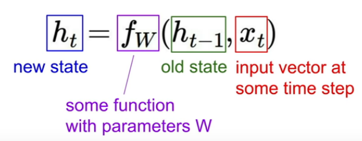

### Calculating new state and _recurrence_:

For example: for every word in a sentence, run the word through the RNN function (the input word is a one-hot vector):

$$h_t = \tanh ( W_{hh} h_{t-1} + W_{xh} x_t )$$

At the first step ($t = 1$), the function takes the first word $x_1$, and a hidden state $h$ as inputs. Since the hidden state is initialized to a vector of zeroes, the first hidden state is essentially the tanh of the first word (tanh is applied element-wise; it squashes each value to betwenn -1 and 1):

$$h_1 = \tanh ( W_{xh} x_1 )$$


The second word $x_2$ together with previous step's hidden state $h_1$ are fed into the same function to produce a new hidden state $h_2$:

$$h_2 = \tanh ( W_{hh} h_1 + W_{xh} x_2 )$$


This process is repeated until the end of the sentence.


Both $x_t$ and $h_t$ have their own set of weights $W_{xh}$ and $W_{hh}$ (as a fully connected layer) that remain unchanged during the forward pass.

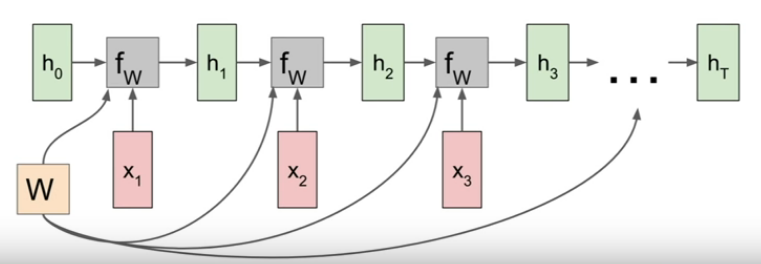

If you want to produce an output $y_t$ at each step, you can introduce another set of weights $W_{hy}$ and multiply by the current hidden state:

$$y_t = W_{hy} \times h_t $$

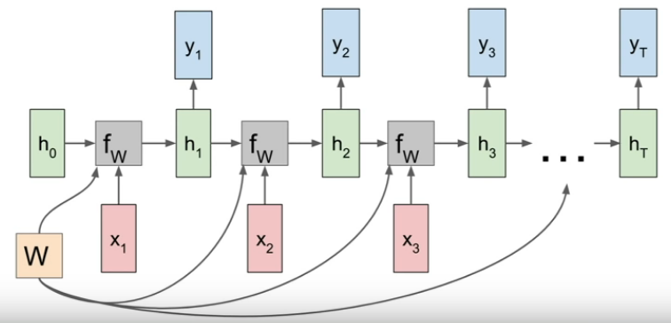

In code, it looks like this:


```python
class RNN:
    '''A single recurrent cell'''
    # Initialize the hidden state to zeros
    self.h = np.zeros(some_size)
    def step(self, x):
        '''Update the hidden state'''
        self.h = np.tanh(np.dot(self.W_hh, self.h) + np.dot(self.W_xh, x))
        # Optional: compute the output vector
        y = np.dot(self.W_hy, self.h)
        return y

rnn = RNN()
```

Reminder: `np.dot(a, b)` is the [dot-product](https://en.wikipedia.org/wiki/Dot_product#Algebraic_definition) of 2 vectors (__not__ element-wise!).

`np.tanh` is applied element-wise.

Notice that there are __three sets of weights__! $W_{hh}$ (`self.W_hh`) for the hidden state; $W_{xh}$ (`self.W_xh`) for the input; and $W_{hy}$ (`self.W_hy`) for the output.

The hidden state `self.h` is initialized to a vector of zeros.

`np.tanh` function implements a non-linearity that squashes the activations to the range `[-1, 1]`.

For each step in a sequence, you'd run the line below to update the hidden state:


```python
rnn.step(x) # x is an input vector
```

Of course, you can daisy-chain (stack) RNN models so that the output of one cell becomes the input of a downstream cell:


```python
y1 = rnn.step(x)
y2 = rnn2.step(y1)
```

For each prediction, there's the accompanying loss (usually softmax loss):

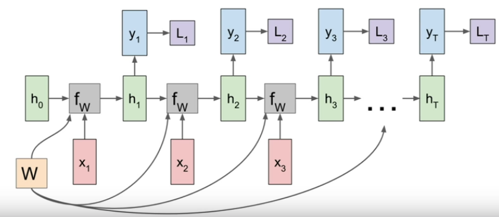

The final loss is the sum of all individual loss at each step:

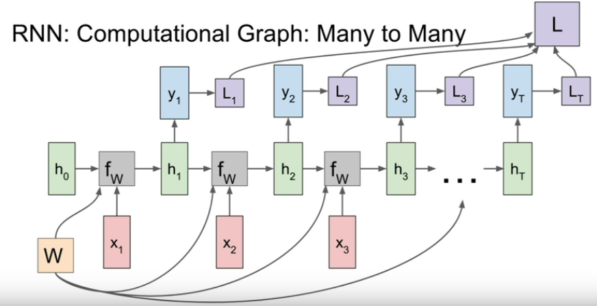

On the backwards pass, the loss gradient flows through each time-step, and each step will compute the local gradient for weights $W_{hh}$, $W_{xh}$, and $W_{hy}$. Which are then summed for the final gradient for the weights $W$.

In a __many-to-one__ model, the last hidden state $h_T$ at the end of the sentence can be considered a summary of the input sentence.

Whereas for a __one-to-many__ model, the input is an initializer for step 1 of the hidden state.

A __sequence-to-sequence__ model (eg, neural machine translation) is basically a many-to-one model placed before a one-to-many model.

It operates in 2 stages:
1. the model upfront __encodes__ the input sequence of words to a single summary vector. That vector is the hidden state of the last step of the model.
1. the model downstream __decodes__ that vector into a sequence of words in another language.

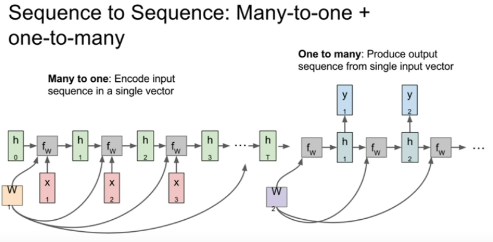

### RNN example


Let's say that we have a character-level model that predicts what the next letter should be given an input letter. Assume the vocabulary consists of only 4 letters: h, e, l, o; and we're training the model to predict the word 'hello'.

The characters are first converted to a 4-element, one-hot vector:


#### Training

The input vector multiplies by the input weight matrix $W_{xh}$ to get the first hidden state. That hidden state is then multiplied by an output weight matrix $W_{hy}$ to produce a list of scores for each letter:


For the first letter 'h', the correct next letter should be 'e', but it gave 'o' a higher score. In this case, we'd use a softmax loss to quantify (a scalar) how wrong the prediction is, and that loss's gradient will be fed back into the cell during the backwards pass. This process repeats during training.

#### Testing

At test time, each input's score is converted to a probability distribution by a softmax function. A prediction is then __sampled__ from that distribution. That prediction is then fed back to the next time-step:

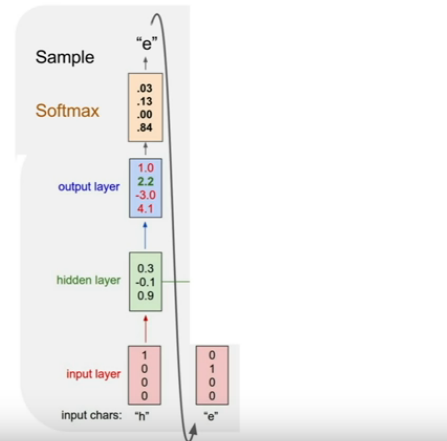

And this process repeats:

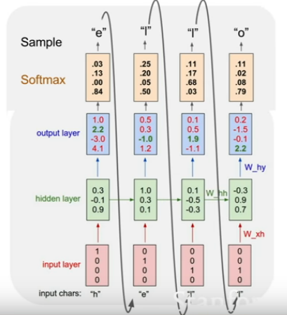

#### Questions

Why __sample__ from the distribution? Why not just take the character with the highest score (argmax)?

- Sometimes you do take the argmax. The advantage with sampling is that you get variety in your outputs so that you don't always end up with the same output given the same input. eg, the same image can be captioned in a few different ways by the model.

During test time, when the first prediction is made, can you feed the softmax score into the next round (instead of using the one-hot vector)?

- No, because the softmax scores look very different from what the model saw during training. This can cause bad outputs.
- The other problem is that the using a dense vector as an input can be computationally expensive. If your vocabulary size is 10,000, then the input vector becomes a dense softmax vector of 10,000 numbers.

### Backpropagation through time

During the forward pass, you're stepping through time to compute the loss. During the backward pass, you're stepping backwards through time to compute the gradient.

What if the input sequence is very long? Like Wikipedia-sized long? You can't just run through all wikipedia text forward and backward to produce one gradient update; you'll run out of memory and never converge because it's so slow.

Just as you'd make a gradient update after every few images for a CNN, you can do the same thing (mini-batch) to gradient updates in a RNN:  you run a gradient update once every few words (say, 100 words). This is known as a __truncated backpropagation through time__.

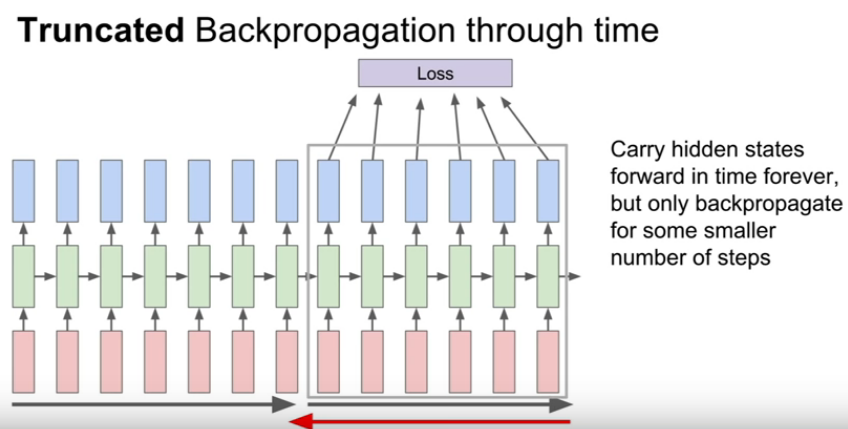

### The hidden state visualized

What information is stored in the hidden state? ie, what exactly does it 'remember'?

[This paper](https://arxiv.org/abs/1506.02078) selects one number from the hidden state vector, and see which characters cause a spike in activation when an input sequence is fed into the model.

Most elements from the hidden state vector aren't easily interpretable:


But some elements activate in a more interpretable way:

Quote detection:


Line break:


`if` statement conditions:

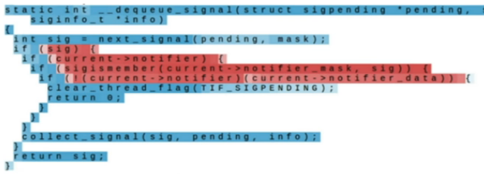

The take-away is that even though the model was trained to predict the next character, it also learned useful structural rules of the input data.

### Image captioning

Use a CNN to distill an image down to a summary vector $v$. Use that as another input to the hidden state formula. $v$ also has its own weights $W_{ih}$.

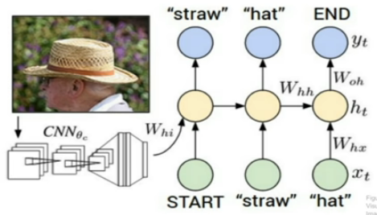

The initial input is a special `<START>` token.

Previously, the hidden state was calculated like this:

$$h_t = \tanh ( W_{hh} h_{t-1} + W_{xh} x_t )$$

Now we have an image vector $v$ and its weights $W_{ih}$ to account for:

$$h_t = \tanh ( W_{hh} h_{t-1} + W_{xh} x_t + W_{ih} v)$$

__It's important to note that the image vector is not used as the input $x_t$__!

For training, the labels must have special tokens marking the `<START>` and `<END>` of the sentence. This tells the network to stop generating words whenever it has sampled an `<END>` token.


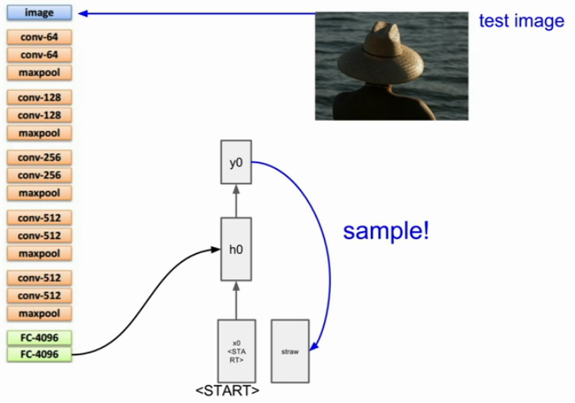

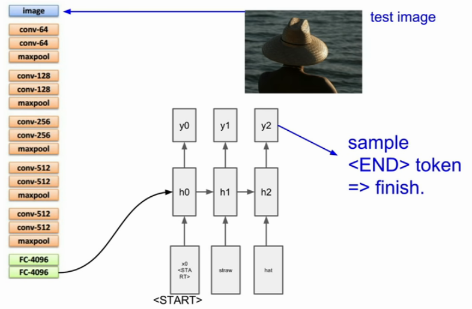

Example results:

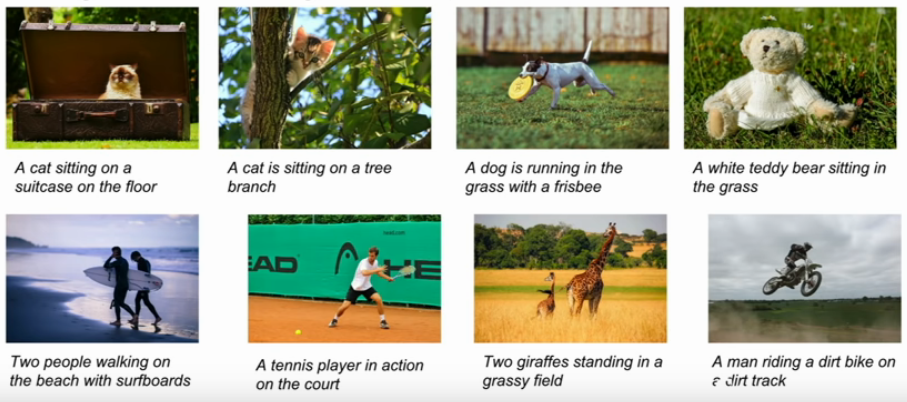

Bad results:

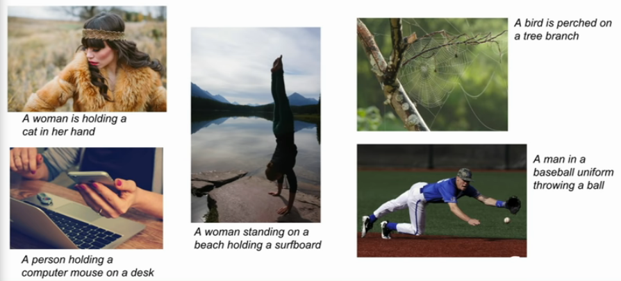

### Image captioning with attention

instead of outputting a single summary vector, it outputs a grid of vectors. imagine the image is divided into grids of 9 squares. then the output matrix will have 9 vectors, each corresponding to its own location in the grid.

besides sampling the output vocab, the model also produces a distribution of image locations that it wants to look. This distribution can be seen as the attention of the model (ie, where it is looking at).

the attention matrix is produced by the current hidden state

the attention matrix multiplies by the image matrix to produce a summary vector $z$. This is fed into the next time-step to produce the next step's hidden state (together with 

The attention mechanism for text input is similar to that for images. Instead of outputting a single hidden state at the end, the RNN outputs _all_ hidden states. Each state corresponds to the word that it saw during each time-step.

A separate distribution is also produced to __annotate__ where the model wants to look at. This annotation is the attention.

### Problem with RNN

#### Vanishing/Exploding gradient

On the backwrd pass, the gradient is multiplied by the same weight matrix over and over again. this can cause the gradient to grow (explode) dramatically, or diminish (vanish) greatly.

Image one number in the weight matrix. If it is greater than 1, it's multiplied by the gradient many times over many time-steps, that'll cause the gradient to explode. If the number is less than 1, it'll cause the gradient to vanish towards zero.


A hack to fix to the exploding gradient problem is to clip the gradient by clamping it down to a pre-set maximum.

To solve the vanishing gradient problem, we need to change the RNN structure.

## LSTM

lstm solves the problem of vanishing/exploding gradient

lstm has one extra state: cell state $c_t$. It's a vector.

the cell state updated by 4 gates

- $i$: input gate
- $f$: forget gate
- $o$: output gate
- $g$: 'gate' gate

the hidden state from the previous time-step and the weight matrix are used to calculate 4 gates. These 4 gates, with the previous cell state are used to calculate the current cell state.

the current cell step and the forget gate are used to calculate the new hidden state.

stack the previous hidden state and the current input, multiply by the weight matrix to produce a vector. Each element of the vector is then run through a sigmoid function to calculate i,f,o gates, and a tanh to get the g gate.

- i: whether to write to the new cell state
- f: how much to forget from the previous hidden state
- o: how much to reveal from the cell state to the new hidden state (which is then passed to the next time step)
- g: how much to write to the new cell state


Stacking vectors: literally stack 1 vector on top of another. for example:

```
if  A = [1 5 3]

and B = [8 6 4]

stack(A, B) -> [1 5 3 ; 8 6 4]
```

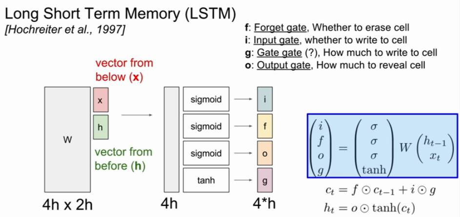

Reminder: __$\odot$ is element-wise multiplication between vectors__.

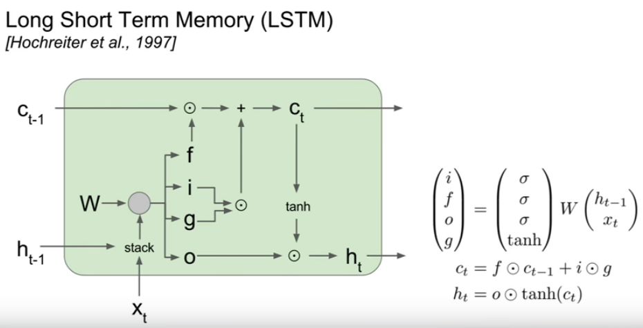

The input and the previous step's hidden state are stacked (concatenated) and multiply by the weights $W$:

$W \begin{pmatrix}
h_{t-1} \\
x_t
\end{pmatrix}
$

The product of that is run through 3 sigmoid and 1 tanh to produce the 4 gates:

$$f = \sigma \begin{pmatrix} W_f \cdot \begin{bmatrix} h_{t-1}, x_t \end{bmatrix} + b_f \end{pmatrix}$$

$$i = \sigma \begin{pmatrix} W_i \cdot \begin{bmatrix} h_{t-1}, x_t \end{bmatrix} + b_i \end{pmatrix}$$

$$o = \sigma \begin{pmatrix} W_o \cdot \begin{bmatrix} h_{t-1}, x_t \end{bmatrix} + b_o \end{pmatrix}$$

$$g = \tanh \begin{pmatrix} W_g \cdot \begin{bmatrix} h_{t-1}, x_t \end{bmatrix} + b_g \end{pmatrix}$$

Simplified (bias term is implied):

$$f =  \sigma \begin{pmatrix} W \begin{pmatrix}
h_{t-1} \\
x_t
\end{pmatrix} \end{pmatrix}
$$

$$i =  \sigma \begin{pmatrix} W \begin{pmatrix}
h_{t-1} \\
x_t
\end{pmatrix} \end{pmatrix}
$$

$$o =  \sigma \begin{pmatrix} W \begin{pmatrix}
h_{t-1} \\
x_t
\end{pmatrix} \end{pmatrix}
$$

$$g =  \tanh \begin{pmatrix} W \begin{pmatrix}
h_{t-1} \\
x_t
\end{pmatrix} \end{pmatrix}
$$

Combined (bias term is implied):

$$\begin{pmatrix}
i \\
f \\
o \\
g \\
\end{pmatrix} = \begin{pmatrix}
\sigma \\
\sigma \\
\sigma \\
\tanh \\
\end{pmatrix} W \begin{pmatrix}
h_{t-1} \\
x_t
\end{pmatrix}
$$

Compute the current cell state:

$$c_t = f \odot c_{t-1} + i \odot g$$

Compute the current hidden state:

$$h_t = o \odot \tanh(c_t)$$

The forget gate $f$ controls what old information to reset. the input gate $i$ controls whether to update the cell state, and the go gate $g$ controls how much new information goes into the cell state. The output gate $o$ controls how much of the cell state is exposed to produce the current hidden state.

The sigmoid gates squashes values to between 0 and 1. But if we only consider extreme values, 0 or 1, it becomes to easier to understand what is going on. A 0 will reset information, and a 1 will retain it in the cell state. The same applies to the input gate $i$: 1 for allowing inputs, 0 for allowing nothing.

For the go gate $g$, it's a $\tanh$ gate with values between -1 and 1. Using either -1 or 1 to illustrate its effect, we can see that because it is multiplied __element-wise__ by the input gate $i$ (which is between 0 and 1) $i \odot g$, the product will be a vector of either 0, 1, or -1. When adding $f \odot c_{t-1}$ and $i \odot g$ together, the latter part becomes a counter that either maintains, increments, or decrements the former.


```python

```

---

## Additional reading

Google's 2014 [sequence to sequence paper](https://papers.nips.cc/paper/5346-sequence-to-sequence-learning-with-neural-networks.pdf) says that "... we found that reversing the order of the words in all source sentences (but not target sentences) improved the LSTM’s performance markedly, ...".

> Surprisingly, the LSTM did not suffer on very long sentences, despite the recent experience of otherresearchers with related architectures [26]. We were able to do well on long sentences because wereversed the order of words in the source sentence but not thetarget sentences in the training and testset. By doing so, we introduced many short term dependenciesthat made the optimization problemmuch simpler (see sec. 2 and 3.3). As a result, SGD could learnLSTMs that had no trouble withlong sentences. The simple trick of reversing the words in the source sentence is one of the keytechnical contributions of this work.

> ... we found it extremely valuable to reverse the order of the words of the input sentence. So for example, instead of mapping the sentence `a, b, c` to the sentence `α, β, γ`, the LSTM is asked to map `c, b, a` to `α, β, γ`, where `α, β, γ` is the translation of `a, b, c`. This way, `a` is in close proximity to `α`, `b` is fairly close to `β`, and so on, a fact that makes it easy for SGD to 'establish communication' between the input and the output. We found this simple data transformation to greatly boost the performance of the LSTM.

> While we do not have a complete explanation to this phenomenon, we believe that it is caused by the introduction of many short term dependencies to the dataset. Normally, when we concatenate a source sentence with a target sentence, each word in the source sentence is far from its corresponding word in the target sentence. As a result, the problem has a large "minimal time lag" [17]. By reversing the words in the source sentence, the average distance between corresponding words inthe source and target language is unchanged. However, the first few words in the source language are now very close to the first few words in the target language, so the problem’s minimal time lag is greatly reduced. Thus, backpropagation has an easier time "establishing communication" between the source sentence and the target sentence, which in turn results in substantially improved overall performance.

> Initially, we believed that reversing the input sentences would only lead to more confident predictions in the early parts of the target sentence and to less confident predictions in the later parts. However, LSTMs trained on reversed source sentences did much better on long sentences than LSTMs trained on the raw source sentences ..., which suggests that reversing the input sentences results in LSTMs with better memory utilization.

Does fastai library implement this sentence-reversal technique as input data augmentation?

[Yes](https://forums.fast.ai/t/reverse-text-input-as-data-augmentation/56069), you can specify `backwards=True` when [creating a text databunch](https://docs.fast.ai/text.data.html#TextLMDataBunch.create). The [parent class](https://docs.fast.ai/text.data.html#LanguageModelPreLoader) explains what the arg does.

Searched fastai form with keywords "reverse words LSTM" and found this thread: [DeepLearning-Lec11-Notes](https://forums.fast.ai/t/deeplearning-lec11-notes/16407). Then searched for the word "reverse" in the post, and found this line: "Bi Directional: Take all your sequences and reverse them and make a 'backwards model' then average the predictions."

#### Epiphany moment

This reversal of input sequence is what makes the **bi** in **bi**directional LSTM, in which the input sequence is looked at both from the front-to-back, **and** back-to-front. This creates 2 hidden states that are stacked together.

For a many-to-many model, how does it know when to start generating outputs? And when to stop generating outputs?

It knows to start generating outputs when it receives an end-of-sentence `<EOS>` token. And when the output samples the same token, the model stops generating outputs.


### The paper trail from encoder-decoder network to Transformers

[This paper](https://arxiv.org/abs/1406.1078) introduced the encoder-decoder architecture that uses 2 modified RNNs (with 2 gates to control how much of the hidden state to forget or modify). The encoder turns a variable-length sequence (sentence of words) into a fixed length vector representation. The decoder uses that vector to produce either a score or sequences that are fed in to a statistical machine translation model to help improve its performance.

[This paper](https://arxiv.org/abs/1409.3215) from Google used 2 LSTMs to create an encoder-decoder model for neural machine translation. The encoder turns a variable-length sequence (sentence of words) into a fixed length vector. That vector is fed into the decoder and outputs a variable-length sequence (the translation). They discovered that reversing the input sentence improves the translation score markedly.

Read this illustrated article on [Visualizing A Neural Machine Translation Model](https://jalammar.github.io/visualizing-neural-machine-translation-mechanics-of-seq2seq-models-with-attention/) before reading the next paper.

[This paper](https://arxiv.org/abs/1409.0473) added attention to the encoder-decoder architecture. It also used a bi-directional RNN encoder. The authors argued that turning a sentence into a single vector creates a bottleneck, and can limit the performance (how well it translates a sentence) of the model. By adding a soft attention vector that learns which parts of the input sentences that matter, it can improve the performance of the model. This attention vector will direct the decoder to look for specific words in the input when generating an output word.
It does not encode the input sentence into a single fixed-length vector. Instead, it encodes the input sentence into a sequence of vectors, and chooses a subset of these vectors adaptively while emitting the translation. This frees a neural translation model from having to squash all the information of a source sentence, regardless of its length, into a fixed-length vector. This allows a model to cope better with long sentences.

LSTM gates control how hidden states update the cell state by specifying what to forget, and what to update (and how much to update). This reminds me of the book Why We Sleep by neuroscientist Matthew Walker. In it, he mentions the 2 phrases of sleep: REM and NREM (non-REM) sleep. We switch between these 2 modes during sleep. One mode removes memory, and the other edits existing memory. This is almost exactly identical to what the gating mechanism in a LSTM does.

#### Epiphany moment

hidden states are short-term memories. cell states are long-term memories. the 4 gates in an lstm control how the new, short-term memories should update the long-term memory.

