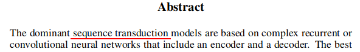

Trying to understand what transformers are by reading its paper [Attention is All You Need](https://arxiv.org/pdf/1706.03762.pdf).

https://jalammar.github.io/illustrated-transformer/

## Abstract

What is __sequence transduction__?

Transduction: translation of energy from one form into another. eg, your nerve cells sense heat energy, and fire off electrical signals, so that your brain can feel heat. in this case, your nerve cells are a transducer. Another example is a microphone's magnet converting sound wave (vibrations) into electrical signals. It's an interpretation of a signal, sometimes converted into a form that can be understood and processed by something like a brain. Note that the energy itself is not converted into another form of energy.

Induction: derive a function from given data

Deduction: plug numbers into the function to make predictions

Transductive Learning: get predictions directly from given data (no approximation function needed). Example: k-nearest algorithm. It does not model the training data, but uses it directly each time a prediction is required.

In NLP, a transducer is a model that outputs one time-step (word) for each input time-step (word) provided (ie, an output is produced for each input it reads in; and only ONE output for each input; aka finite-state transducer).

Transduction is a synonym for transformation: Many machine learning tasks can be expressed as the transformation (transduction) of input sequences into output sequences.

__Sequence transduction__: the transformation (transduction) of input sequences into output sequences. eg, turning sound waves into words (speech recognition); turning one sequence of words in one language, into another language (machine translation).

Source: https://machinelearningmastery.com/transduction-in-machine-learning/

Why call it a "time-step", and not something more concrete like "word"?

Because the inputs are not always a sequence of words. It could be a sequence of images (like a video). Since words uttered, and frames played are ordered from earlier to later, each word or frame is a step forward or backward in time.

---

### Note to self

transformers have something to do with RNNs

and I have a poor understanding of what RNNs are

figure RNNs out before continuing

- discards RNN and CNN altogether
- the problem with rnns is that it runs sequentially. this makes it hard to parallelize while training.
- since attention mechanisms allow you to not worry about the distance between input words, you don't need recurrence to feed inputs sequentially.
- transformer relies exclusively on attention to figure out the relationship between input & output, this allows parallelization to boost the performance.
- transformer also has an encoder-decoder structure
- transformer has residual connections!!!

---

[Video: Stanford CS224N - Transformers and Self-Attention](https://www.youtube.com/watch?v=5vcj8kSwBCY)

forgo RNN's hidden states as representation, instead, use attention as representation

each attention head is like a feature detector (like a kernel/filter in cnn)

http://jalammar.github.io/illustrated-transformer/

> each attention head projects the input embeddings into a different representation subspace

like how different filters highlight different features)

key-value:
key: the word
value: the attn representation

however far back in history it is, you stil have access to it
